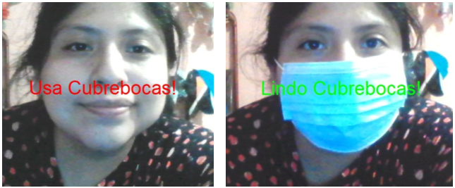

# NMD - No Mack Detector


#### *See this project in action [NMD - No Mask Detector](https://nicodemozilli.github.io/NMD/)*


**INTRODUCTION**

Due to the times of the COVID-19 pandemic, currently the use of masks has become mandatory for access to certain places and establishments, in order to improve their sanitation measures. In this document, the No Mask Detector project is presented as a system that allows detecting people who do not use masks. First, the detected problem that led to the creation of this project is presented, as well as the justification and objective of the project.
Subsequently, a little of the theory of convolutional neural networks, which are the fundamental part for an application such as No Mask Detector can function properly, helping in the classification of the images taken will be exposed. We will also show which are the key technologies for the creation of No Mask Detector, to finally show a video demonstrating its training process and its operation for the detection of people with and without masks.

**PROBLEM**

To guarantee the use of masks in places of high concurrence is a difficult task to carry out, since sanitary filters should be implemented in certain points or every certain distance, this is impractical due to the exposure of the delegates.

**JUSTIFICATION**

The intention is to create a web application available to anyone interested, with the capacity to identify the people who do not wear the mouth cover, showing a message about the use of the same.

**OBJECTIVE**

This application aims to ensure health safety protocols by Covid 19 involving the proper use of mouth covers in crowded places, implementing a neural network to identify those who do not comply with this.

## CONVOLUTIONAL NEURAL NETWORKS FOR IMAGE CLASSIFICATION

A ***convolutional neural network (CNN)*** can be understood as a deep learning algorithm that can take an input image, assign importance (usually called learnable weights and biases) to various aspects or objects in the image and thereby be able to differentiate one from the other.

The preprocessing required in a convolutional neural network is much less compared to other classification algorithms. While in primitive methods the filters to perform such classifications are designed by hand, a convolutional neural network with sufficient training has the ability to learn these filters or features.

<center>
	
	*Representative illustration of Convolutional Neural Network 	Functioning*
</center>

No Mask Detector seeks to train and use a convolutional neural network that allows us to identify whether or not a person is wearing a mask, seeking to be focused to improve access control to places that require mandatory use of masks when entering the establishment, or place.

## Employed Technologies

<center>
	</img>
</center>

HTML (HyperText Mark-Up Language) is what is known as "mark-up language", whose function is to prepare written documents by applying formatting tags.

 These tags indicate how the document is presented and how it is linked to other documents. HTML is also used for reading documents on the Internet from different computers thanks to the HTTP protocol, which allows users to remotely access documents stored at a specific address on the network, called a URL.
The World Wide Web (WWW), or simply the web, is the worldwide network of all documents (called web pages) connected to each other by hyperlinks.


<center>
	</img>
</center>

CSS (CASCADING Style Sheets) are cascading style sheets. CSS is a language that complements and formats HTML (HyperText Markup Language) by better organizing lines and adding new possibilities to the code.
With it, you can modify practically everything within your layout (such as colors, background, font characteristics, margins, padding, position, even the site structure with the float property).
CSS helps keep the information in a document separate from the details of how to display it. The details of how to display the document are known as the style. By keeping the style separate from the content, we can avoid duplicate content, facilitate the maintenance of our website and more.

<center>
	</img>
</center>

JavaScript is the programming language responsible for providing greater interactivity and dynamism to web pages. When JavaScript is executed in the browser, it does not need a compiler. The browser reads the code directly, without the need for third parties. It is therefore recognized as one of the three native web languages alongside HTML (content and its structure) and CSS (content design and its structure).
With this client-side programming language (not on the server) we can create effects and animations without any interaction, or responding to events caused by the user himself such as buttons pressed and modifications of the DOM (document object model). Therefore, it has nothing to do with the Java programming language, since its main function is to help create dynamic web pages.

JavaScript programming code runs in browsers, whether desktop or mobile, whether Android or Iphone. It serves exactly the same purpose, no matter what type of device the browser is running on.
JavaScript is able to detect errors in forms, to create beautiful sliders that adapt to any screen, to do mathematical calculations efficiently, to modify elements of a web page easily.

<center>
	</img>
</center>

p5.js is a JavaScript library for creative programming, which aims to make programming accessible and inclusive for artists, designers, educators, beginners and anyone else. p5.js is free and open source.
Using the metaphor of sketching, p5.js has a full set of drawing features. However, you are not limited to just drawing on your canvas. You can take the entire browser page as your sketch, including HTML5 objects for text, input, video, webcam and sound.

<center>
	</img>
</center>

ml5.js aims to make machine learning accessible to a wide audience of artists, creative programmers and students. The library provides access to machine learning algorithms and models in the browser, based on TensorFlow.js.
The library supports code samples, tutorials and example datasets with an emphasis on ethical computing. Data bias, stereotypical harms and responsible crowdsourcing are part of the documentation around data collection and usage, ml5.js is strongly inspired by processing and p5.js.

## Main Code

```js
let video;
let videoSize = 64;
let ready = false;

let classifier;
let pixelBrain;
let mobilenet;
let label = 'Loading DataModel';


function setup() {
  createCanvas(600, 600);
  video = createCapture(VIDEO, videoReady);
  video.size(videoSize, videoSize);
  video.hide();

  let options = {
    inputs: [64, 64, 4],
    task: 'imageClassification',
    debug: true,
  };
  pixelBrain = ml5.neuralNetwork(options);
  modelReady();

}

// Video is ready!
function videoReady() {
  ready = true;
}
function  modelReady(){

  let modelDetails = {
   model: 'modeldata/model.json',
   metadata: 'modeldata/model_meta.json',
   weights: 'modeldata/model.weights.bin'
  };

  pixelBrain.load(modelDetails,customModelReady);
}

function customModelReady(){
  label = 'DataModel Loaded';
  classifyVideo();
}

function classifyVideo() {
  let inputImage = {
    image: video,
  };
  pixelBrain.classify(inputImage, gotResults);
}


function gotResults(error, results) {
  if (error) {
    return;
  }
  label = results[0].label;
  classifyVideo();
}

function draw() {
  background(0);
  if (ready) {
    image(video, 0, 0, width, height);
  }
  textSize(64);
  textAlign(CENTER, CENTER);
  if(label=="nm"){
    fill(color(255,0,0));
    text("Use Mask!", width / 2, height / 2);
  }else if(label=="cm"){
    fill(color(0,255,0));
    text("Nice Mask!", width / 2, height / 2);
  }else if( label=="Loading DataModel" || label=="DataModel Loaded"){
    fill(255);
    text(label, width / 2, height / 2);
  }
}

```

## Demostration and Operation

The operation of the No Mask Detector application is based firstly on a training phase, where you must capture the different states that the application will take into account, these being "Wear masks" and "Cute masks". Once trained, No Mask Detector will be able to identify if a person is or is not using masks, as shown in the following images:

<center>
	</img>
	</img>
	</img>
	</img>
	</img>

## [Explanatory Video](https://www.youtube.com/watch?v=ZJ14-LaC998)

[](https://www.youtube.com/watch?v=ZJ14-LaC998)

##### Coded with 💜 by [Nicodemo Zilli](https://nicodemozilli.github.io)
</center>
